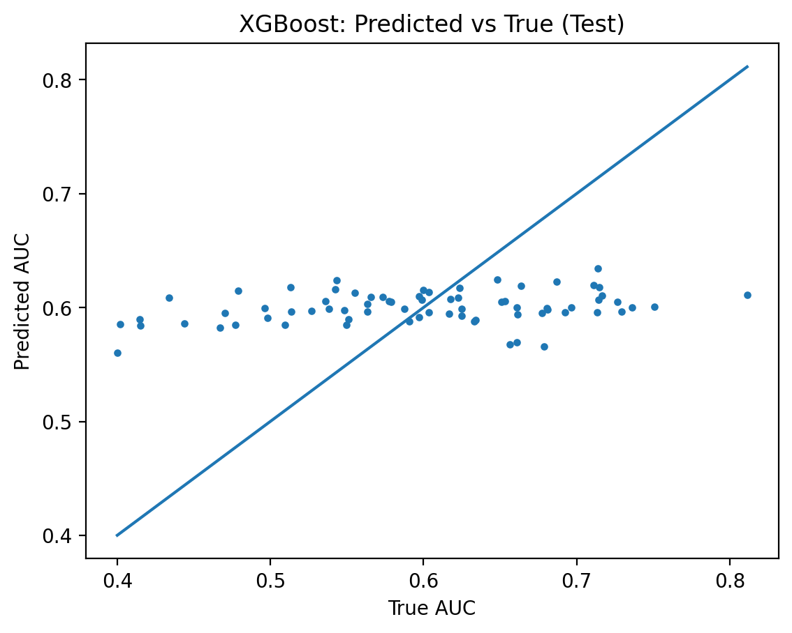

# Cancer Drug Response Prediction from Gene Expression

## Goal
Build a reproducible machine learning pipeline that predicts **drug response** (e.g., IC50/AUC) from **gene expression** data, suitable for a biotech ML portfolio.

## What this repo will include
- Clean train/val/test splitting strategy (leakage-aware)
- Baseline models (Elastic Net / Random Forest)
- Strong models (XGBoost or similar)
- Model interpretability (e.g., feature importance / SHAP)
- Reproducible training + inference scripts
- (Later) a small demo app/API for inference

## Repository structure
- data/ — **ignored by Git** (raw/processed datasets stay local)
- 
otebooks/ — EDA notebooks (keep them tidy and reproducible)
- src/ — reusable Python modules (data prep, features, models)
- configs/ — config files for experiments
- 
eports/figures/ — plots and figures for README/report
- models/ — **ignored by Git** (saved models stay local)
- pp/ — (later) API/UI demo
- 	ests/ — lightweight tests

## Quickstart (local)
1. Create and activate a virtual environment
2. Install dependencies from 
equirements.txt
3. Add data following data/README.md
4. Run training (to be implemented):  
   python -m src.models.train --config configs/default.yaml

## Results (single-drug model: dinaciclib)

Target: PRISM secondary screen **AUC** (regression)  
Best model: **XGBoost** (early stopping; best iteration ≈ 23)

**Test performance**
- RMSE: 0.0898
- MAE: 0.0749
- R²: 0.0659

Artifacts:
- `reports/metrics_modeling_dinaciclib_auc.json`
- `reports/metrics_modeling_dinaciclib_auc.csv`

## Multi-drug benchmark (Top 10 by coverage)

To test whether the pipeline generalizes beyond a single compound, I trained **separate XGBoost models** for the **top 10 compounds by cell-line coverage** (PRISM secondary screen AUC), using a **group-aware split by DepMap cell line (ACH-...)**.

**Aggregate performance (Top 10)**
- Mean TEST RMSE: **0.1058 ± 0.0287**
- Mean TEST R²: **0.0444 ± 0.0868**

**Leaderboard (sample)**
| Compound | TEST RMSE | TEST R² | n cell lines |
|---|---:|---:|---:|
| selinexor | 0.0561 | 0.0576 | 475 |
| tivantinib | 0.0749 | 0.0275 | 475 |
| dinaciclib | 0.0891 | 0.0810 | 476 |
| ganetespib | 0.0982 | 0.0483 | 475 |
| barasertib | 0.1001 | -0.0167 | 475 |
| tepoxalin | 0.1109 | 0.0040 | 475 |

Artifacts:
- `reports/leaderboard_top10_auc_xgb.csv`
- `reports/leaderboard_top10_auc_xgb.json`

## Notes
This repo is currently **local-only** (not on GitHub yet). The structure is designed to publish cleanly later.
